# Einleitung

## Problemstellung

Die systematische Verarbeitung, Bewertung und der Vergleich anhand von historischen Fundamentaldaten, ist für private wie auch für institutionelle Anwender mit erheblichem Aufwand verbunden. Etablierte Anbieter wie Yahoo Finance, [Finanzen.net](http://Finanzen.net) oder Bloomberg sind entweder sehr teuer oder bieten keine gesonderte zeitliche Darstellung für Price-Ratios an. Viele Anbieter zeigen oft nur Price-Earnings zu den Quartalsenden an. Da Unternehmen ihren Bilanzierungskalender und damit ihre Quartale selbst definieren, gehen zusätzlich zeitliche Informationen verloren. Durch die vielen Ratios entsteht das Problem der Informationsüberflutung und da Price-Ratios vor allem für Value-Investoren interessant sind, bietet es sich an einen kombinierten Value Score aus den Ratios zu generieren und in einem Ranking anzuzeigen und mit einem rein technischen Momentum Score Ranking zu vergleichen.

Darüber hinaus erfordert ein System dieser Art eine sorgfältige Softwarearchitektur: Die Kombination aus heterogenen Datenquellen, komplexer Kennzahlenlogik und dem Anspruch an langfristige Wartbarkeit und Erweiterbarkeit macht den Einsatz etablierter Architekturprinzipien – wie Clean Architecture, Dependency Inversion und systematischem Testing – zu einer zentralen Anforderung an die Umsetzung.

Vor diesem Hintergrund stellt sich die Frage, wie eine Anwendung konzipiert und entwickelt werden kann, die historische Fundamentaldaten des S&P500 strukturiert aufbereitet, relevante Kennzahlen berechnet und einen systematischen Vergleich von Unternehmen innerhalb einer Peer Group über einen Zeitraum von ca. 15 Jahren ermöglicht.

## Zielsetzung

Ziel dieser Arbeit ist die Konzipierung und Umsetzung einer Anwendung, die fundamental sowie historische Daten verarbeitet, in einer Datenbank speichert und diese dann in einem Dashboard zur Ansicht zur Verfügung stellt. Verschiedene Ratios sollen für ein Unternehmen über die Zeit dargestellt und vergleichbar gemacht werden. Außerdem sollen Unternehmen untereinander und mit dem Peer-Group Median verglichen werden können. Um den vollen Funktionsumfang eines Dashboards zu gewährleisten sollen auch die historischen Aktienpreise und zum Vergleich mit ihrem Index angezeigt werden. Basierend auf den Ratios wird ein Combined Score ermittelt, der in einem Ranking angezeigt und mit einem Momentum Ranking verglichen werden kann. Prototypisch wird die Anwendung nur für Unternehmen aus dem S&P500 umgesetzt. Das Projekt fokussiert sich auf historische Fundamentaldaten und beinhaltet keine Echtzeitdaten, keine Prognose -Modelle und keine automatisierte Investment-Empfehlung sowie keine empirische Analyse der implementierten Scores.

Neben der fachlichen Funktionalität legt die Arbeit einen expliziten Schwerpunkt auf die softwaretechnische Qualität der entwickelten Anwendung. Durch den Einsatz von Clean Architecture und dem Prinzip der Dependency Inversion soll eine modulare, testbare und wartbare Codebasis entstehen. Automatisierte Tests, strukturiertes Logging sowie die konsequente Trennung von Verantwortlichkeiten (Separation of Concerns) gewährleisten dabei sowohl die Korrektheit der Berechnungen als auch die langfristige Erweiterbarkeit des Systems.

# Grundlagen

## Finanzgrundlagen

### Income Statement (Gewinn- und Verlustrechnung)

Das Income Statement ist eine periodische Finanzaufstellung, die Umsätze, Kosten und das Nettoergebnis eines Unternehmens über einen definierten Zeitraum ausweist. Es bildet die Grundlage für ertragsbezogene Kennzahlen wie das Kurs-Gewinn-Verhältnis (P/E Ratio) und ist zentraler Bestandteil der fundamentalen Unternehmensanalyse.

### Cash Flow Statement (Kapitalflussrechnung)

Die Kapitalflussrechnung stellt die tatsächlichen Zahlungsströme eines Unternehmens dar und gliedert sich in operativen, investiven und finanzierenden Cashflow. Im Gegensatz zum Income Statement ist sie nicht durch buchhalterische Abgrenzungen beeinflusst und ermöglicht damit eine realistischere Beurteilung der Liquidität – relevant insbesondere für den Free Cash Flow als Basis des P/FCF-Ratios.

### Symbol / Ticker

Der Ticker ist ein eindeutiges alphanumerisches Kürzel, das ein börsennotiertes Unternehmen an einer Handelsplattform identifiziert (z.B. `AAPL` für Apple).

### Sector

Der Sektor klassifiziert Unternehmen nach ihrer wirtschaftlichen Haupttätigkeit gemäß dem Global Industry Classification Standard (GICS), z.B. _Information Technology_, _Health Care_ oder _Financials_.

### Trailing

Trailing bezeichnet die rückwärtsgerichtete Betrachtung einer Kennzahl auf Basis tatsächlich realisierter Vergangenheitswerte.

### TTM – Trailing Twelve Months

TTM ist die gebräuchlichste Form der Trailing-Berechnung und aggregiert die Finanzdaten der jeweils letzten zwölf Monate – unabhängig vom Geschäftsjahresende des Unternehmens. Da Unternehmen ihren Bilanzierungskalender selbst definieren, sorgt TTM für eine zeitlich konsistente und unternehmensübergreifend vergleichbare Datenbasis.

### Index

Ein Aktienindex aggregiert die Kursentwicklung einer definierten Gruppe von Unternehmen zu einer einzigen Kennzahl und dient als Markt- oder Sektorreferenz. Im Kontext dieser Anwendung bildet der **S&P 500** den Referenzindex, gegen den die historische Kursentwicklung einzelner Unternehmen im Dashboard verglichen wird.

### Weighted Average Shares Outstanding

Die gewichtete durchschnittliche Anzahl ausstehender Aktien berücksichtigt Veränderungen im Aktienbestand – etwa durch Aktienrückkäufe oder Neuemissionen – anteilig über den Berichtszeitraum. Sie ist die Berechnungsgrundlage für den Earnings per Share (EPS) und beeinflusst damit direkt alle EPS-basierten Kennzahlen wie das P/E-Ratio. Im Kontext dieser Anwendung wird ausschließlich die Diluted-Variante verwendet, da sie das vollständige Verwässerungspotenzial eines Unternehmens abbildet und damit eine konservativere sowie aus Anlegerperspektive realistischere Bewertungsgrundlage darstellt.

### Price - Adjusted Closed

Der Price bezieht sich im Projektkontext immer auf den adjusted Closed Preis eines Handelstages. Er ist die modifizierte Version des Closed Wertes, der Aktien Spaltung, Dividenden und andere Events berücksichtigt und ermöglicht dadurch eine realistischere Betrachtung.

### Price / Earnings - PE - Ratio

Diese relative Kennzahl setzt den Tages Price und die Earnings eines Unternehmens in Verhältnis. Dabei wird der Price durch die TTM Earnings per Share (EPS) geteilt.

$\quad P/E = \frac{\text{Price per Share}}{\text{EPS diluted (TTM)}}$

### Price / Sales - PS - Ratio

Diese relative Kennzahl setzt den Tages Price und die Revenues eines Unternehmens in Verhältnis. Dabei wird der Price durch die TTM Revenues per Share geteilt.

$\quad P/S = \frac{\text{Price per Share}}{\text{Revenue per Share (TTM)}}$

### Price / Operating Cashflow - PC - Ratio

Diese relative Kennzahl setzt den Tages Price und die Operating Cashflows eines Unternehmens in Verhältnis. Dabei wird der Price durch die TTM Operating Cashflows per Share geteilt.

$\quad P/C = \frac{\text{Price per Share}}{\text{Operating Cashflow per Share (TTM)}}$

### Price / Free Cashflow - PFCF - Ratio

Diese relative Kennzahl setzt den Tages Price und die Free Cashflows eines Unternehmens in Verhältnis. Dabei wird der Price durch die TTM Free Cashflows per Share geteilt.

$\quad P/FCF = \frac{\text{Price per Share}}{\text{Free Cashflow per Share (TTM)}}$

### Value Strategy

> "Value investing involves picking stocks that seem to be trading for less than their book value." (Investopedia 2025)

Eine Value Strategie basiert auf der Annahmen, dass der Aktienpreis sich von dem tatsächlichen Wert eines Unternehmens im positiven wie auch im negativen entkoppeln kann, jedoch über einen langen Zeitraum zu ihrem wahren Wert zurückkehrt. Um diese Strategie am Aktienmarkt umzusetzen werden mittels verschiedener Methoden die wahren Unternehmenswerte ermittelt. Eine Methode ist es über die Fundamentaldaten auf den Unternehmenswert Rückschlüsse zu führen. Die Hypothese von Value Investoren ist, dass man in unterbewertete Aktien investiert und sich diese mit der Zeit in Richtung ihres eigentlichen Wertes, und damit positiv entwickeln.

### James O’Shaughnessy und der Value Composite

James O'Shaughnessy ist ein Amerikanischer Investor, CEO von O'Shaughnessy Ventures und Gründer von O'Shaughnessy Asset Management. In seinem Buch “What Works on Wall Street” stellt er unter anderem den Value Composite One vor. Dieser besteht aus den einem kombinierten Score aus Price-to-book Ratio, Price / Sales Ratio, EBITDA / Enterprise Value, Price / Cashflow Ratio und Price / Earnings Ratio. In seinem Buch hat er mit einem Backtest von 1963 bis 2009 gezeigt, dass man mittels der Kombination aus mehreren Metriken eine Einzelmetrik in 82% der Fällen am Aktienmarkt schlägt. Sein kombinierter Score hatte eine jährliche Rendite von 17.18%. vgl. O'Shaughnessy (2011), zitiert nach Estoppey (2024)

### Momentum Strategy

Ein Momentum Indikator ist ein technischer Indikator, der dazu verwendet werden kann kurzfristige Börsentrends zu identifizieren. vgl. (Sue Man Fan 2010, S. 87) Investoren, die der Momentum Strategie folgen, gehen davon aus, dass Aktien, die gut laufen, auch weiterhin gut laufen werden. "[...] strategies which buy stocks that have performed well in the past and sell stocks that have performed poorly in the past generate significant positive returns over 3-to 12-month holding periods." (JEGADEESH & TITMAN 1993, Abstract).

## Statistische Grundlagen

### Median

“Der **Median** oder **Zentralwert** ist dadurch charakterisiert, daß jeweils mindestens 50% der Beobachtungen xt , . . . , xn einen Wert größer oder gleich bzw. kleiner oder gleich dem Median annehmen.” (Härtung, J.; Elpelt, B.; Klösener, K.-H. 2004, S. 32)

$\quad \tilde{x} =
\begin{cases}
X_{\frac{n+1}{2}}, & \text{falls } n \text{ ungerade} \\
\\
0{,}5 \cdot \left( X_{\frac{n}{2}} + X_{\frac{n+2}{2}} \right), & \text{falls } n \text{ gerade}
\end{cases}
$

### Median der absoluten Abweichung

Die MAD ist definiert als Median der absoluten Abweichungen vom Median (Iglewicz & Hoaglin 1993, S. 11):

$\quad \text{MAD} = \text{median}(|x_i - \tilde{x}|)$

### Modified **Z-Score**

Der klassische Z-Score basiert auf dem arithmetischen Mittel und der Standardabweichung, welche beide stark durch Ausreißer beeinflusst werden und somit keine robusten Schätzer darstellen (vgl. Iglewicz & Hoaglin 1993).

Als robuste Alternative werden der Median als Lageparameter sowie die Median Absolute Deviation (MAD) als Streuungsmaß verwendet. Beide weisen einen hohen Breakdown Point von etwa 50 % auf und sind damit deutlich weniger sensitiv gegenüber Ausreißern (vgl. Iglewicz & Hoaglin 1993).

Darauf aufbauend ergibt sich der Modified Z-Score nach Iglewicz & Hoaglin (1993) zu:

$\quad M_i = \frac{0.6745 \cdot (x_i - \tilde{x})}{\text{MAD}}$

## Technologische Grundlagen

### Clean Architecture

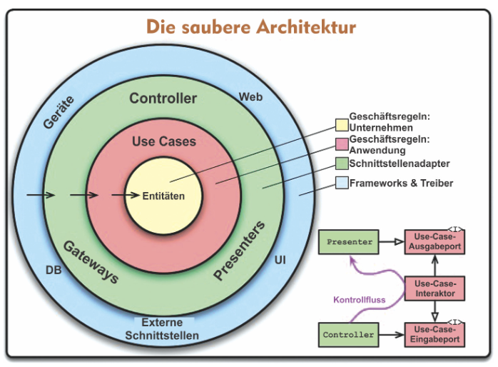

Abb. 1: Die saubere Architektur (Martin 2018, S. 193)

Die Clean Architektur folgt einer Regel: “Quellcode-Abhängigkeiten dürfen nur nach innen in Richtung der übergeordneten Richtlinien weisen.” (Martin 2018, S. 194)

Diese Architektur stellt folgende Eigenschaften sicher:

- **Framework-Unabhängigkeit**:
  Die Kernlogik der Anwendung ist nicht an ein bestimmtes Framework gebunden. Frameworks und Libraries werden als austauschbare Werkzeuge eingesetzt, ohne dass sie die Struktur des Systems diktieren.

- **Testbarkeit**:
  Die Geschäftslogik – also Kennzahlenberechnung und Score-Ermittlung – kann isoliert getestet werden, ohne dass eine Datenbankverbindung, ein laufendes UI oder externe Dienste notwendig sind.

- **UI-Unabhängigkeit**:
  Die Präsentationsschicht ist vollständig von der Businesslogik entkoppelt. Das bestehende Streamlit-Dashboard könnte beispielsweise durch ein anderes Frontend ersetzt werden, ohne dass eine einzige Zeile der Score-Berechnung angepasst werden müsste.

- **Datenbank-Unabhängigkeit**:
  Die Geschäftsregeln haben keine direkte Kenntnis der verwendeten Datenbank. MongoDB könnte theoretisch gegen eine relationale Datenbank oder einen anderen Datenspeicher ausgetauscht werden, da die Kommunikation ausschließlich über Abstraktionen erfolgt.

- **Unabhängigkeit von externen Komponenten**:
  Die Domain- und Applikationsschicht hat keinerlei direkte Abhängigkeit zu externen Datenquellen oder Schnittstellen. Ob Daten über eine Finanz-API, eine CSV-Datei oder einen anderen Kanal bezogen werden, ist für die Kernlogik irrelevant.

### Dependency inversion Principle

“High-level modules should not depend upon low-level modules. Both should depend upon abstractions. Abstractions should not depend upon details. Details should depend upon abstractions.” (Martin 1996, S. 6)

Das DIP ist eines der SOLID - Prinzipien und ermöglicht es die Abhängigkeitsrichtung von Modulen umzukehren, in dem Module nur noch von Abstraktionen abhängig sind und nicht mehr von konkreten Implementierungen. Dies ermöglicht bspw. einen vereinfachten Austausch von einzelnen externen Komponenten oder einfacheres Testing.

### Dependency Injection

Dependency Injection ist ein Design Pattern, das die praktische Umsetzung des DIP ermöglicht. Anstatt dass eine Klasse ihre Abhängigkeiten selbst instanziiert, werden diese von außen übergeben. Dadurch bleibt die Klasse unabhängig von konkreten Implementierungen und kennt ausschließlich die Abstraktion.

### Repository

Das Repository Pattern entstammt dem Domain-Driven Design (DDD) und abstrahiert den Datenzugriff vollständig von der Businesslogik. Die Services arbeiten ausschließlich gegen ein definiertes Interface und haben keine Kenntnis darüber, aus welcher Datenbank oder externen API stammen.

### Decorator Pattern

Das Decorator Pattern ist ein strukturelles Entwurfsmuster, das einer bestehenden Klasse zur Laufzeit zusätzliches Verhalten hinzufügt, ohne ihre Schnittstelle zu verändern. Der Decorator implementiert dasselbe Interface wie die dekorierte Klasse und umhüllt sie – er delegiert den eigentlichen Aufruf weiter und ergänzt ihn um zusätzliche Logik.

### Python

Python ist eine weitverbreitete und im Finanz und Datenbereich beliebte Programmiersprache ist. Python bietet mit pymongo, pytest und jsonschema direkt relevante Bibliotheken für den Anwendungsfall. Dabei ist pymongo für den Datenbankzugriff, pytest für das Testing und jsonschema für die Schema-Validierung besonders nützlich.

### MongoDB

MongoDB ist ein dokumentorientiertes NoSQL-Datenbankmanagementsystem und verwaltet Collections in JSON-ähnlichen Dokumenten. Dadurch dass die Rohdaten in JSON Dateien vorliegen ist der die Entscheidung für eine dokumentorientierte Datenbank naheliegend. MongoDB stellt spezialisierte Time-Series-Collections bereit, die für zeitreihenbasierte Abfragen optimiert sind. Durch die spezielle Persistierung ist die Time Series Collection performanter in Abfragen und ermöglicht so eine schnelle Bereitstellung von vielen Datenpunkten. vgl. (MongoDB, Inc. 2026) Außerdem bietet MongoDB ein Aggregation Framework welches eine Verarbeitung auf Datenbankebene ermöglicht und in gewissen Fällen deutlich effizienter ist als die Verarbeitung mit Python. Dieses Framework bietet sich vor allem für Verarbeitungsschritte an, die keine Business Logik beinhalten, sondern Daten nur transformiert oder verschiebt.

### Streamlit

Streamlit ist ein open-source Python Framework, das die Erstellung von interaktiven Web-Applikationen und Dashboards direkt aus Python-Code ermöglicht, ohne dass separate Frontend-Kenntnisse in HTML, CSS oder JavaScript erforderlich sind.

### Docker

Docker ist eine Open-Source-Plattform zur Containerisierung von Anwendungen. Ein Container bündelt den Anwendungscode zusammen mit allen Abhängigkeiten, Bibliotheken und Konfigurationsdateien in einer isolierten, portablen Einheit. Im Gegensatz zu virtuellen Maschinen teilen sich Container den Kernel des Host-Betriebssystems, was sie deutlich ressourceneffizienter und schneller in der Ausführung macht. vgl. (Docker, Inc. 2026)

Durch die Containerisierung wird sichergestellt, dass die Anwendung in jeder Umgebung identisch läuft – unabhängig davon, ob sie lokal entwickelt oder produktiv betrieben wird. Mithilfe von Docker Compose lassen sich mehrere Container, beispielsweise für Python-Anwendungen, MongoDB-Datenbank und Streamlit-Dashboard, gemeinsam definieren und mit einem einzigen Befehl starten. Dies vereinfacht die Einrichtung der Entwicklungsumgebung erheblich und gewährleistet die Reproduzierbarkeit des gesamten Systems.

## Datengrundlage

Die Datengrundlage wird von [Financial Modeling Prep](https://site.financialmodelingprep.com/) geliefert und liegt in JSON-Files vor. Dabei liefert Financial Modeling Prep (FMP) Income Statements, Cash Flow Statements, Stock Price Data und Company Profile Data.

### Income Statement Schema

```json
[
  {
    "date": "2024-09-28",
    "symbol": "AAPL",
    "reportedCurrency": "USD",
    "cik": "0000320193",
    "filingDate": "2024-11-01",
    "acceptedDate": "2024-11-01 06:01:36",
    "fiscalYear": "2024",
    "period": "FY",
    "revenue": 391035000000,
    "costOfRevenue": 210352000000,
    "grossProfit": 180683000000,
    "researchAndDevelopmentExpenses": 31370000000,
    "generalAndAdministrativeExpenses": 0,
    "sellingAndMarketingExpenses": 0,
    "sellingGeneralAndAdministrativeExpenses": 26097000000,
    "otherExpenses": 0,
    "operatingExpenses": 57467000000,
    "costAndExpenses": 267819000000,
    "netInterestIncome": 0,
    "interestIncome": 0,
    "interestExpense": 0,
    "depreciationAndAmortization": 11445000000,
    "ebitda": 134661000000,
    "ebit": 123216000000,
    "nonOperatingIncomeExcludingInterest": 0,
    "operatingIncome": 123216000000,
    "totalOtherIncomeExpensesNet": 269000000,
    "incomeBeforeTax": 123485000000,
    "incomeTaxExpense": 29749000000,
    "netIncomeFromContinuingOperations": 93736000000,
    "netIncomeFromDiscontinuedOperations": 0,
    "otherAdjustmentsToNetIncome": 0,
    "netIncome": 93736000000,
    "netIncomeDeductions": 0,
    "bottomLineNetIncome": 93736000000,
    "eps": 6.11,
    "epsDiluted": 6.08,
    "weightedAverageShsOut": 15343783000,
    "weightedAverageShsOutDil": 15408095000
  }
]
```

### Cash Flow Statements Schema

```json
[
  {
    "date": "2024-09-28",
    "symbol": "AAPL",
    "reportedCurrency": "USD",
    "cik": "0000320193",
    "filingDate": "2024-11-01",
    "acceptedDate": "2024-11-01 06:01:36",
    "fiscalYear": "2024",
    "period": "FY",
    "netIncome": 93736000000,
    "depreciationAndAmortization": 11445000000,
    "deferredIncomeTax": 0,
    "stockBasedCompensation": 11688000000,
    "changeInWorkingCapital": 3651000000,
    "accountsReceivables": -5144000000,
    "inventory": -1046000000,
    "accountsPayables": 6020000000,
    "otherWorkingCapital": 3821000000,
    "otherNonCashItems": -2266000000,
    "netCashProvidedByOperatingActivities": 118254000000,
    "investmentsInPropertyPlantAndEquipment": -9447000000,
    "acquisitionsNet": 0,
    "purchasesOfInvestments": -48656000000,
    "salesMaturitiesOfInvestments": 62346000000,
    "otherInvestingActivities": -1308000000,
    "netCashProvidedByInvestingActivities": 2935000000,
    "netDebtIssuance": -5998000000,
    "longTermNetDebtIssuance": -9958000000,
    "shortTermNetDebtIssuance": 3960000000,
    "netStockIssuance": -94949000000,
    "netCommonStockIssuance": -94949000000,
    "commonStockIssuance": 0,
    "commonStockRepurchased": -94949000000,
    "netPreferredStockIssuance": 0,
    "netDividendsPaid": -15234000000,
    "commonDividendsPaid": -15234000000,
    "preferredDividendsPaid": 0,
    "otherFinancingActivities": -5802000000,
    "netCashProvidedByFinancingActivities": -121983000000,
    "effectOfForexChangesOnCash": 0,
    "netChangeInCash": -794000000,
    "cashAtEndOfPeriod": 29943000000,
    "cashAtBeginningOfPeriod": 30737000000,
    "operatingCashFlow": 118254000000,
    "capitalExpenditure": -9447000000,
    "freeCashFlow": 108807000000,
    "incomeTaxesPaid": 26102000000,
    "interestPaid": 0
  }
]
```

### Stock Price Data Schema

```json
[
  {
    "symbol": "AAPL",
    "date": "2025-02-04",
    "adjOpen": 227.2,
    "adjHigh": 233.13,
    "adjLow": 226.65,
    "adjClose": 232.8,
    "volume": 44489128
  }
]
```

### Company Profile Data Schema

```json
[
  {
    "symbol": "AAPL",
    "price": 232.8,
    "marketCap": 3500823120000,
    "beta": 1.24,
    "lastDividend": 0.99,
    "range": "164.08-260.1",
    "change": 4.79,
    "changePercentage": 2.1008,
    "volume": 0,
    "averageVolume": 50542058,
    "companyName": "Apple Inc.",
    "currency": "USD",
    "cik": "0000320193",
    "isin": "US0378331005",
    "cusip": "037833100",
    "exchangeFullName": "NASDAQ Global Select",
    "exchange": "NASDAQ",
    "industry": "Consumer Electronics",
    "website": "https://www.apple.com",
    "description": "...",
    "ceo": "Mr. Timothy D. Cook",
    "sector": "Technology",
    "country": "US",
    "fullTimeEmployees": "164000",
    "phone": "(408) 996-1010",
    "address": "One Apple Park Way",
    "city": "Cupertino",
    "state": "CA",
    "zip": "95014",
    "image": "https://images.financialmodelingprep.com/symbol/AAPL.png",
    "ipoDate": "1980-12-12",
    "defaultImage": false,
    "isEtf": false,
    "isActivelyTrading": true,
    "isAdr": false,
    "isFund": false
  }
]
```

# Hauptteil

## Konzeption

### Methodisches Vorgehen

Die Entwicklung der Anwendung erfolgte nach einem iterativen und prototypischen Vorgehensmodell. Ziel war es, die komplexe Kombination aus Datenverarbeitung, Kennzahlenberechnung und Visualisierung schrittweise zu entwickeln und frühzeitig zu validieren.

Zu Beginn wurde ein Minimalprototyp umgesetzt, der den grundlegenden Datenfluss vom Import der Rohdaten bis zur Darstellung erster Kennzahlen abbildet. Darauf aufbauend wurde die Anwendung in mehreren Iterationen erweitert, wobei Datenpipeline, Services und Dashboard schrittweise ergänzt und durch Unit-Tests abgesichert wurden.

Das Vorgehen orientiert sich an Prinzipien agiler Softwareentwicklung, ohne ein formales Framework wie Scrum vollständig umzusetzen. Stattdessen lag der Fokus auf kurzen Entwicklungszyklen und kontinuierlicher Validierung der Ergebnisse.

### Peer-Group-Vergleich

Da die einzelnen Sektoren unterschiedlichen Bedingungen und damit auch unterschiedlichen Ratio Niveaus und Abweichungen unterliegen, ist es sinnvoll eine Sektor-relative Bewertung vorzunehmen. Das heißt, dass Aktien werden nur mit Aktien in ihrem Sektor verglichen.

### Combined Value Score

Zur Aggregation der zur Verfügung stehenden PE - Ratio, der PS - Ratio und der PFCF - Ratio wird ein Combined Value Score definiert. Die PC - Ratio wird für den Score verworfen, da der Cashflow sonst übergewichtet wäre, und der Free Cashflow einen besseren Einblick über die tatsächlich zu Verfügung stehenden liquiden Mittel gibt.

Da die Ratios im Vergleich unterschiedliche Skalen aufweisen, aber dennoch gleichgewichtet werden sollen, erfolgt eine Standardisierung mittels des Modified Z-Scores.

Für die Berechnung der Modified Z-Score standardisierten Ratios werden die Mediane des Sektores und der MAD des Sektores verwendet, da der Vergleich innerhalb der Peer-Group und nicht mit der Historie der Einzelaktie stattfinden soll. Der Betrachtungszeitraum für den Median und den MAD ist 1 Jahr.

$$\tilde{z}_{i,r} = 0{,}6745 \cdot \frac{x_{i,r} - \tilde{x}_{s,r}}{\text{MAD}_{s,r}}$$

wobei $x_{i,r}$ die Ratio des Unternehmens $i$, $\tilde{x}_{s,r}$ der Sektormedian und $\text{MAD}_{s,r}$ die mittlere absolute Abweichung des Sektors für Ratio $r$ über ein Jahr ist.

Als nächstes wird der Median der drei standardisierten Ratios genommen. Eine unterbewertete Aktien hat einen vergleichsweise geringen Price im Verhältnis zu ihren Earnings / Sales / Casflow. Durch die Division haben diese Aktien im Vergleich zu überbewerteten Aktien eine kleinere Price - Ratio. Da diese Aktien unterhalb des Sektor Medians sind führt das dazu, dass der berechnete Z-Score dieser Aktien eine negative Zahl ist. Je kleiner der Combined Value Score, desto unterbewerteter ist die Aktie. Dies ist für Laien nicht intuitiv und deshalb wird der Wert als letzter Schritt invertiert.

$$\text{CVS}_i = -1 \cdot \text{median}\left(\tilde{z}_{i,\text{PE}},\ \tilde{z}_{i,\text{PS}},\ \tilde{z}_{i,\text{PFCF}}\right)$$

### Momentum Score

Der Momentum Score basiert rein auf technischen Daten und wird im Projektkontext aus der Rendite der letzten 6 Monate gebildet. Der Betrachtungszeitraum wird auf 6 Monate definiert, da JEGADEESH & TITMAN 3 - 12 Monatszeiträume getestet haben und 6 Monate in dem genannten Zeitraum liegen. Je besser die Performance der letzten 6 Monate, desto höher der Score. Der Momentum Score dient in dieser Arbeit als Vergleichsstrategie und wird darum nicht näher untersucht.

$$
\text{Price Index}_{6M} = \frac{Price_{end}}{Price_{start}} - 1
$$

Für den Momentum Score werden die Price-Ratios außer acht gelassen, da diese kein verlässlicher Momentum Indikator sind. Wenn bspw. die PE-Ratio steigt, kann dies sowohl auf steigende Preise wie auch auf fallende Earnings hinweisen. Dementsprechend ist die PE-Ratio nicht ohne weiteres mit Blick auf ein Momentum interpretierbar. Dies gilt ebenso für die anderen Price Ratios.

### Berechnungsflussdiagramm

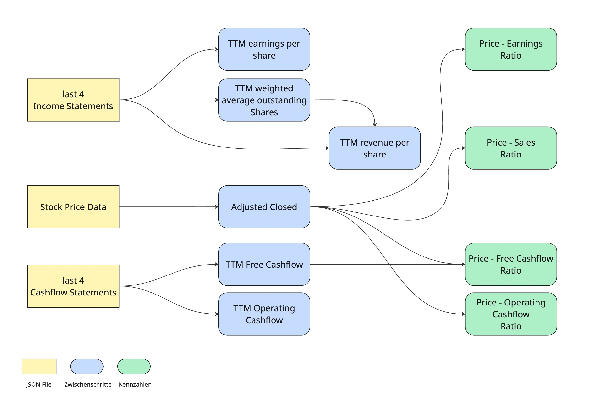
Abb. Berechnungsfluss Price - Ratios.

Aus den letzten vier Income Statements werden die TTM Earnings per Share und die TTM Weighted Average Outstanding Shares ermittelt. Danach weren die TTM Revenues per Share berechnet. Aus den letzten vier Cashflow Statements werden die TTM Cashflows berechnet. Aus den Stock Price Data werden die Adjusted Closed Werte extrahiert und mit den anderen Kennzahlen zu den Price - Ratios verarbeitet.

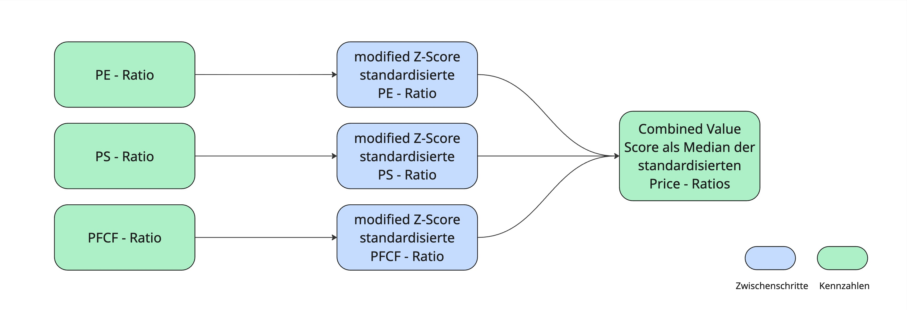
Abb. Berechnungsfluss Combined Value Score.

Die drei Price - Ratios (PE, PFCF, PS) werden mittels dem modified Z-Score standardisiert. Danach wird der Median dieser standardisierten Werte genommen und invertiert.

## Entwurf und Implementierung

### Datenfluss

Ein großteil der Datenverarbeitung geschieht mittels dem Aggregation Frameworks auf Datenbankebene. Dies hat performance technische Gründe, da so kein Datenaustausch über das Netzwerk geschehen muss und das Framework für Datenbankoperationen optimiert wurde. Business Logik soll testbar sein und das ist innerhalb des Aggregation Frameworks schwer. Darum wird an einigen Stellen auf die Nutzung des Aggregation Frameworks verzichtet und Python benutzt.

#### FinanceData

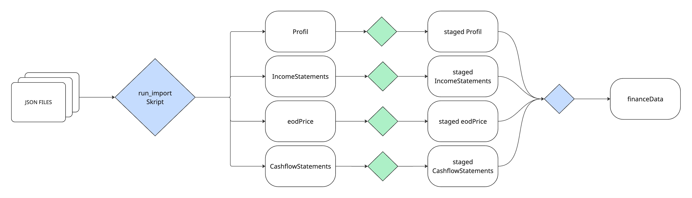

Abb. 4: Datenfluss Finanzdaten Zeitreihe. Quelle: Eigene Darstellung

Nach dem Import in die "raw" Datenbank werden die Daten mit dem Mongo Aggregation Framework vorverarbeitet. Dabei werden für den Kontext unwichtige Informationen aus den Collections gefiltert und gegebenenfalls Typumwandlungen gemacht. Verschachtelte Objekte werden abgeflacht, sodass die Daten näher an das Zielschema kommen.
Die Finanzdaten Zeitreihe wird dann in Python erstellt. Dazu wird die eodPrice Collection durchlaufen, um für jedes Datum die Ratios berechnet. Die letzten vier Incomestatements und die letzten vier Cashflowstatements werden nach einer Validierung genutzt, um die TTM Average Outstanding Shares, die TTM Earnings per Share, den TTM Revenue per Share und die TTM Cashflows zu berechnen. Dies dient als Grundlage für die Berechnung der Price - Ratios. Falls die Berechnung fehlschlägt oder die Statements nicht Korrekt sind, bzw. nicht die erwarteten letzten vier sind, wird die betroffene Ratio auf NONE gesetzt.

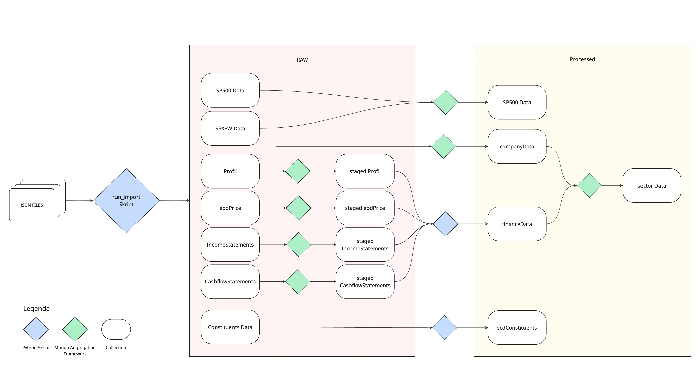

Abb. 4: Datenflussdiagramm. Quelle: Eigene Darstellung

#### Constituents - scdConstituents

Aus der 0_sp_500_constituents_historical_2026.json wird eine Slowly Changing Dimension Type 2 erstellt, um nachvollziehen zu können, wann ein Unternehmen in den Index aufgenommen oder aus dem Index herausgenommen wurde. Diese Collection bleibt bisher ungenutzt, ist aber schon angelegt, da für eine Evaluierung von einer Value Strategie diese Informationen wichtig sind, um einen möglichen Survivorship Bias auszuschließen.

#### S&P500 Data

Für einen Vergleich mit dem Index werden aus den Files SPXEW_autoadjusted.json und ^GSPC_eod_prices.json Zeitreihen für den S&P 500 Index und für den S&P 500 Equal Weights Index extrahiert. Die Extrahierung geschieht durch das Mongo Aggregation Framework.

#### Company Data

Aus der Profil Collection wird durch das Mongo Aggregation Framework die Company Data Collection erstellt. Dabei werden nur ausgewählte Properties übernommen.

#### Sector Data

Diese Collection ist das Ergebnis der Aggregation aus der Financedata Zeitreihe durch das Mongo Aggregation Framework. Nach einem Join mit der CompanyData Collection wird nach Sektoren und Datum gruppiert und der Median der Ratios wird berechnet.

### Systemarchitektur

Die Anwendung orientiert sich an der Clean-Architecture von Robert C. Martin und dem der traditionellen horizontalen Schichtenmodell. Sie besteht aus Infrastructure, Presentation, Application und Domain Layer, wobei die Abhängigkeiten nach innen gerichtet sind, sodass die Services und die Datenpipeline von der Datenbank und dem User Interface entkoppelt sind. Dies stellt die Testbarkeit der Business Logik sicher und macht das System flexibel für den Austausch von Infrastruktur.

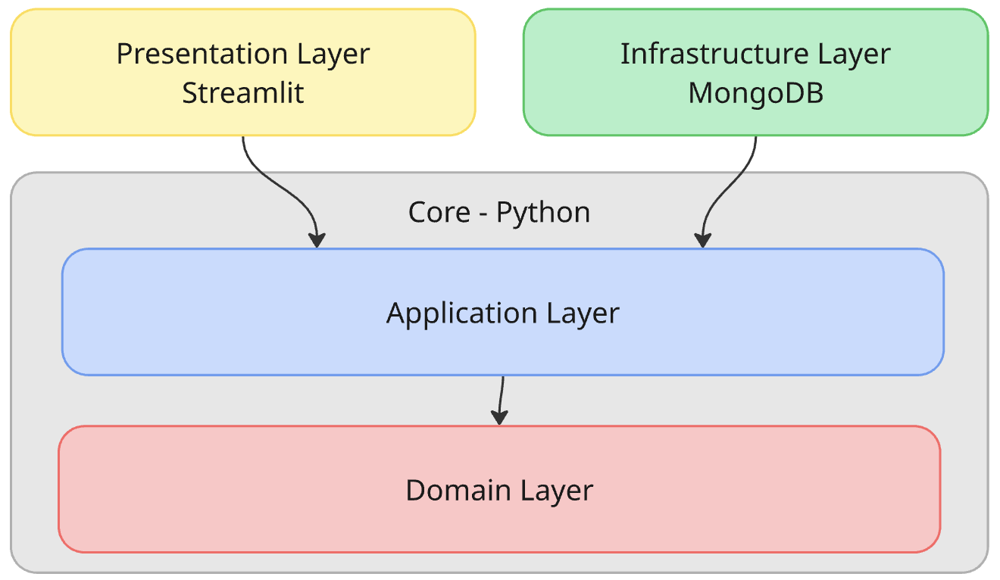

Abb. 2: Systemarchitektur. Quelle: Eigene Darstellung

Die Anwendung besteht im Kern (Core) aus dem Application Layer, der die Services, und dem Domain Layer, der die Business Logik, beziehungsweise die Berechnungsvorschriften enthält. Das Infrastructure Layer kapselt die Mongo Verbindung und beinhaltet die Repository - Logik. Die Presentation layer wird durch Streamlit bereitgestellt, und injiziert die Dependencies in die Services. Die Anwendung wird mittels Docker-Compose containerisiert, um das Deployment auf einem anderen Server zu vereinfachen.

```
anwendung
├── app
│   ├── pages
│   ├── shared
│   └── streamlit_app.py # Entry Point
├── core
│   ├── application
│   │   ├── dashboard_service.py
│   │   ├── notification_service.py
│   │   ├── pipeline_service.py
│   │   ├── ranking_service.py
│   │   └── run_import.py
│   ├── domain
│   │   ├── calculation.py
│   │   └── validation.py
│   ├── exceptions
│   └── interfaces
│       └── base_repository_interface.py
├── infrastructure
│   └── mongo
│       ├── mongo_connection.py
│       └── mongo_repository.py
├── Dockerfile
├── docker-compose.yml
├── config
├── logs
├── scripts
└── tests
```

### Docker

Das `Dockerfile` basiert auf dem schlanken python:3.11-slim Image, um die Container-Größe minimal zu halten. Die Abhängigkeiten werden über requirements.txt installiert und die Streamlit-Applikation wird auf Port 8501 exponiert. Die `docker-compose.yml` definiert zwei Services. Der mongodb Service verwendet das offizielle MongoDB Community Server Image und persistiert die Datenbankdaten in einem externen Docker Volume, sodass die Daten einen Neustart des Containers überleben.

Über das `docker-entrypoint-initdb.d` Verzeichnis wird beim ersten Start ein Initialisierungsskript ausgeführt, das die Datenbankbenutzer und Datenbanken einrichtet. (siehe Skript)

Der Streamlit Service wird aus dem lokalen Dockerfile gebaut und ist über depends_on mit dem MongoDB Service verknüpft, sodass die Applikation erst startet, wenn die Datenbank verfügbar ist. Umgebungsvariablen wie Datenbankverbindung und Credentials werden über eine .env -Datei injiziert und sind damit nicht im Quellcode hinterlegt. Log-Dateien und Datendateien werden über Volumes in das Host-Dateisystem gemountet, was eine persistente Fehleranalyse außerhalb des Containers ermöglicht. Das MongoDB Volume ist als external: true konfiguriert, wodurch es unabhängig vom Container-Lifecycle existiert und ein unbeabsichtigtes Löschen der Datenbankdaten beim Neustart verhindert wird.

### Skript

Das `mongo-entrypoint.sh` Skript aktiviert beim ersten Start der Mongo Instanz die Authentifizierung automatisch. Per Default ist die Authentifizierung deaktiviert und wird aus Sicherheitsgründen in der Anwendung aktiviert. vgl. (MongoDB, Inc. 2026) Es werden zwei Datenbank User und zwei Datenbanken eingerichtet. Es gibt eine Datenbank “raw” für Rohdaten und Zwischenschritte und eine Datenbank “processed” für die finalen Daten. Der erste User hat Lese und Schreibe Rechte auf beiden Datenbanken und wird genutzt um die Daten zu verarbeiten. Der zweite User hat nur Leserechte auf der “processed” Datenbank. Dieses Prinzip der minimalen Rechtevergabe bildet eine weitere Sicherheit vor einem ungewollten Schreib-Zugriff und ist im Sinne des Separation of Concerns.

### Logging

Das Logging ist in zwei separate Logger aufgeteilt. Der Applikations-Logger protokolliert relevante Vorkommnisse während der Datenpipeline – etwa JSON-Dateien, die nicht importiert werden konnten, leer waren oder die Schema-Validierung nicht bestanden haben. Der MongoDB-Logger erfasst datenbankspezifische Ereignisse wie Verbindungsfehler oder fehlgeschlagene Schreiboperationen. Beide Logger verwenden strukturierte Log-Level (INFO, WARNING, ERROR) und schreiben in dedizierte Log-Dateien, um eine gezielte Fehleranalyse zu ermöglichen. Zusätzlich existiert ein Performance-Logger, der als Decorator an beliebige Funktionen ohne diese zu verändern angehängt werden kann und deren Ausführungszeit dokumentiert. Dies ermöglicht eine gezielte nachträgliche Optimierung rechenintensiver Schritte.

### Testing

Die Anwendung wird durch automatisierte Unit Tests mit pytest abgesichert. Die Tests konzentrieren sich auf den Domain Layer und den Application Layer, da dort die gesamte Business Logik der Anwendung liegt.

#### Teststrategie

Es werden zwei Testebenen unterschieden. Auf der ersten Ebene werden die reinen Berechnungs- und Validierungsfunktionen des Domain Layers isoliert getestet. Da diese Funktionen keine externen Abhängigkeiten besitzen, können sie direkt mit Eingabewerten aufgerufen und deren Rückgabewerte geprüft werden. Auf der zweiten Ebene wird der PipelineService des Application Layers getestet. Hier werden die Repository-Abhängigkeiten mittels unittest.mock durch Mock-Objekte ersetzt, die vordefinierte Testdaten zurückgeben. Dies ermöglicht es, das Verhalten des Services isoliert zu testen, ohne eine Datenbankverbindung zu benötigen – ein direkter praktischer Nachweis der gewählten Clean Architecture und des Dependency Inversion Principle.

#### Abdeckung

Die Tests folgen einer mehrschichtigen Abdeckungsstrategie:

- **Happy Path**: Jede Funktion wird zunächst mit validen Eingaben auf korrekte Ergebnisse geprüft, etwa die Berechnung der PE-Ratio aus realistischen AAPL-Finanzdaten.
- **Edge Cases und Grenzwerte**: Kritische Randfälle werden explizit abgedeckt, darunter eine MAD von 0 bei der Robust-Z-Score-Berechnung, ein Startpreis von 0 beim CAGR oder weniger als vier verfügbare Quartale bei der TTM-Berechnung.
- **None-Propagation**: Da nicht für jeden Handelstag alle Finanzkennzahlen berechnet werden können, wird konsequent getestet, ob None-Werte in Eingabedaten korrekt erkannt und weiterpropagiert werden, statt zu Folgefehlern zu führen. Hierfür existieren dedizierte Fixtures mit teils fehlenden Werten.
- **Validierungslogik**: Die Funktion contains_right_income_statements prüft, ob die vier zugehörigen Quartalsberichte für ein gegebenes Datum korrekt und konsistent vorliegen. Getestet werden dabei Duplikate innerhalb der Perioden, None-Werte in Perioden oder Kalenderjahren, zeitlich inkonsistente Statements mit zu großem Jahresabstand sowie ein Bewertungsdatum, das jünger als der neueste vorliegende Bericht ist.
- **Verhaltensverifikation**: Bei den Service-Tests wird nicht nur geprüft, ob Repository-Methoden aufgerufen wurden, sondern welche Daten dabei übergeben wurden. Über insert_many.call_args wird sichergestellt, dass Symbol, Datum und alle berechneten Ratios im persistierten Dokument korrekt enthalten sind.

#### Testdaten

Die Testdaten sind in einer zentralen conftest.py als wiederverwendbare Fixtures organisiert. Die Finanzdaten orientieren sich an realistischen AAPL-Dimensionen, um praxisnahe Berechnungen verifizieren zu können. Für Grenzfall-Tests existieren dedizierte Fixtures, etwa sample_financedata_only_none oder sample_income_period_w_duplicates, die gezielt fehlerhafte oder unvollständige Datensituationen abbilden.

### Config - Datei

#### logging_config.py

Die Datei zentralisiert die Logging-Konfiguration der gesamten Anwendung. Die Funktion `setup_logging()` richtet zwei getrennte Logging-Kanäle ein: Einen dedizierten Logger für alle Datenbankoperationen (`mongo`), dessen Ausgaben in die Datei `logs/mongo.log` geschrieben werden, sowie einen allgemeinen Logger für alle übrigen Anwendungsereignisse, der in `logs/app.log` schreibt. Beide Logger verwenden ein einheitliches Nachrichtenformat mit Zeitstempel, Log-Level und Modulname. Für die Mongo-Logdatei wird ein `RotatingFileHandler` eingesetzt, der die Datei automatisch rotiert, sobald sie eine Größe von 1 MB überschreitet, und dabei bis zu drei ältere Versionen aufbewahrt. Durch `mongo_logger.propagate = False` wird verhindert, dass Mongo-Logs doppelt – also sowohl in `mongo.log` als auch in `app.log` – erscheinen.

Zusätzlich stellt die Datei den Decorator `performance_log` bereit. Dieser kann beliebigen Funktionen vorangestellt werden und protokolliert automatisch Start, Ende sowie die Ausführungsdauer einer Funktion. Im Fehlerfall wird die vollständige Exception inklusive Stacktrace geloggt und anschließend weitergegeben, sodass die normale Fehlerbehandlung erhalten bleibt.

#### mongo_config.py

Die Datei zentralisiert alle Konfigurationswerte für den MongoDB-Zugriff. Datenbankbezeichnungen und Collection-Namen werden als Enum-Klassen definiert, wodurch Tippfehler bei der Verwendung im restlichen Code vermieden werden und IDEs Autovervollständigung anbieten können.

Die Anwendung verwendet zwei verschiedene MongoDB-Nutzer mit unterschiedlichen Berechtigungen: Der appUser wird für Schreib- und Lesezugriffe im Rahmen der Datenpipeline verwendet, der dashboardUser besitzt ausschließlich Leserechte und wird vom Streamlit-Dashboard genutzt.

Die Verbindungsdaten wie Host, Port, Nutzername und Passwort werden nicht hart im Code hinterlegt, sondern aus Umgebungsvariablen geladen, die in einer `.env`-Datei definiert sind. Daraus werden vollständige MongoDB-Verbindungs-URIs zusammengesetzt.

Darüber hinaus enthält die Datei zwei weitere Konfigurationsobjekte: `FILTER_QUERIES_UPLOAD` definiert pro Collection, welche Felder als eindeutiger Schlüssel beim Hochladen von Daten dienen, um Duplikate zu vermeiden. `FINANCEDATA_TIMESERIES_CONFIG` enthält die Parameter zur Erstellung der MongoDB Time-Series-Collection.

#### pipeline_config.py

Die Datei enthält alle MongoDB Aggregation Pipelines der Anwendung zentral an einem Ort. Jede Pipeline beschreibt eine Abfolge von Verarbeitungsschritten, die MongoDB auf Datenbankebene ausführt, bevor Ergebnisse an die Anwendung zurückgegeben oder in eine Ziel-Collection geschrieben werden.

**Staging-Pipelines (EOD_STAGED, INCOME_STAGED, CASHFLOW_STAGED)**

Diese drei Pipelines überführen Rohdaten aus den Upload-Collections in bereinigte Staging-Collections. Dabei werden Datentypen konvertiert – etwa Datumsstrings in echte MongoDB-Date-Objekte oder Jahreszahlen in Integer – und irrelevante Felder werden per `$project` herausgefiltert. Die `EOD_STAGED`-Pipeline verwendet zusätzlich `$unwind`, da die Kursdaten im Rohdatensatz als verschachteltes Array im Feld historical vorliegen und zunächst auf einzelne Dokumente aufgeflacht werden müssen. Alle drei Pipelines schreiben ihr Ergebnis mit `$merge` in die jeweilige Staging-Collection, wobei bei bereits vorhandenen Dokumenten (identifiziert über date und symbol) ein Ersetzen stattfindet und neue Dokumente eingefügt werden. So sind Wiederholungsläufe idempotent.

**COMPANY_PIPELINE**

Diese Pipeline verarbeitet die Company Profil Daten. Zunächst filtert `$match` mit einem JSON-Schema alle Dokumente heraus, die nicht dem erwarteten Datenformat entsprechen. Anschließend reduziert `$project` die Felder auf die relevanten Attribute. Ein Sonderfall wird dabei behandelt: Ist das Feld sector ein leerer String, wird es über `$cond` durch den Wert “Unknown” ersetzt, um inkonsistente Daten zu normalisieren. Das Ergebnis wird in die companyData - Collection der processed - Datenbank geschrieben.

**SECTOR_DATA**

Diese Pipeline berechnet sektorweise Mediankennzahlen für die Price-Ratios je Datum. Per `$lookup` werden zunächst die Unternehmensdaten mit den Finanzdaten verknüpft, um jedem Datenpunkt seinen Sektor zuzuordnen. `$replaceRoot` mit `$mergeObjects` flacht die verschachtelten Lookup-Ergebnisse auf Dokumentebene ab. Anschließend gruppiert `$group` die Daten nach Datum und Sektor und berechnet mit dem `$median`-Operator Mediane für die vier Kennzahlen. Das Ergebnis wird mit `$out` direkt als Time-Series-Collection in die processed - Datenbank geschrieben, was die vorherige Collection vollständig ersetzt – im Unterschied zu `$merge`, das nur einzelne Dokumente aktualisiert.

**SP500 und SPXEW**

Diese beiden Pipelines verarbeiten die Indexdaten des S&P 500 (GSPC) und des S&P 500 Equal Weight (SPXEW). Da die SPXEW-Rohdaten in einem ungewöhnlichen Format vorliegen – die Datumsangaben sind Feldnamen des Dokuments statt eigene Felder – wird mit `$objectToArray` das gesamte Dokument in ein Array aus Schlüssel-Wert-Paaren umgewandelt, das anschließend per `$unwind` aufgeflacht wird. Die GSPC-Pipeline verarbeitet die Daten analog zu `EOD_STAGED` und führt beide Ergebnisse dann mit `$unionWith` zusammen, bevor alles gemeinsam als Time-Series-Collection in die processed - Datenbank geschrieben wird.

**CONSTITUES**

Diese kurze Pipeline konvertiert das date-Feld der Constituents-Daten in einen MongoDB-Datumswert und schreibt das Ergebnis per `$merge` zurück in die gleiche Collection – sie dient der nachträglichen Typkorrektur bereits hochgeladener Daten.

#### processed_schema.py

Die Datei definiert JSON-Schemas zur Validierung der Rohdaten vor der Weiterverarbeitung. Für jede relevante Collection ist festgelegt, welche Felder vorhanden sein müssen (`required`) und welchen Datentyp sie haben sollen (`type`). Das Dictionary `VALIDATION_SCHEMAS` verknüpft diese Schemas mit den jeweiligen Collection-Namen und dient als zentraler Nachschlagepunkt für die Validierungslogik in der Anwendung.

### Infrastructure

#### Mongo Connection

Die Klasse `MongoConnection` kapselt den Verbindungsaufbau zur MongoDB. Sie wird mit einem `MongoUser` initialisiert und wählt anhand dessen die passende Verbindungs-URI aus der Konfiguration. Bei `connect()` wird die Verbindung aufgebaut und mit `server_info()` aktiv geprüft – schlägt dies fehl, wird die Ausnahme geloggt und weitergegeben.

Die Klasse implementiert das Kontextmanager-Protokoll (`__enter__`/`__exit__`), sodass sie mit `with MongoConnection(user) as conn:` verwendet werden kann und die Verbindung am Ende des Blocks automatisch geschlossen wird – auch im Fehlerfall.

#### Mongo Repository

Um die Clean Architektur umzusetzen wird für das Repository das Dependency Inversion Principle (DIP) verwendet. Es stellt sicher, dass die Businesslogik nicht von der Infrastruktur abhängig ist. Im Application Layer ( `core/interfaces/base_repository_interface.py` ) wurde eine abstrakte Klasse Namens BaseRepositoryInterface definiert, welches im Infrastructure Layer als Repository implementiert wurde. Der Zugriff auf die Mongo Datenbank erfolgt über dieses Repository. Im Kontext dieser Anwendung übernimmt das Repository dabei implizit auch die Rolle eines Adapters, da es die MongoDB-spezifische Abfragesyntax in die interne Domänensprache übersetzt. Die Instanziierung der konkreten Repositories erfolgt im Entry Point der Anwendung (Streamlit) und wird per Dependency Injection in die Services des Application Layers injiziert. Somit sind die Abhängigkeiten alle nach innen gerichtet.

### Core - Application

#### run_import.py

Die Datei enthält die Geschäftslogik für den Datenimport in die MongoDB. Die zentrale Funktion ist `import_many`, die einen generischen, validierten Massenimport für die Rohdaten-Collections durchführt.

Dabei wird jedes Dokument zunächst gegen das zugehörige JSON-Schema validiert. Valide Dokumente landen in `insert_data`, invalide werden mit Zeitstempel und Fehlermeldung in `rejected_data` gesammelt und später separat in eine Fehler-Collection geschrieben, statt den gesamten Import abzubrechen.

Vor dem eigentlichen Einfügen werden bestehende Dokumente mit identischen Schlüsselfeldern (z. B. symbol und date) gelöscht. Damit wird sichergestellt, dass kein Datensatz doppelt vorliegt, ohne dass ein Unique-Index auf Datenbankebene erforderlich ist. Anschließend werden alle validen Dokumente auf einmal eingefügt.

Die drei Funktionen `import_constituents`, `import_sp500` und `import_spxew` verfolgen eine einfachere Strategie: Da diese Daten immer vollständig neu geliefert werden, wird die Collection vor dem Import geleert (`drop`) und anschließend komplett neu befüllt.

#### pipeline_service.py

Die Klasse `PipelineService` orchestriert die gesamte Datenverarbeitungspipeline der Anwendung. Sie erhält alle benötigten Repository-Objekte per Dependency Injection im Konstruktor, was die Testbarkeit der Klasse sicherstellt, da Repositories im Test durch Mocks ersetzt werden können.

Die `run()`-Methode definiert die Ausführungsreihenfolge aller Verarbeitungsschritte und bildet damit den zentralen Einstiegspunkt der Pipeline.

**Staging-Methoden** (`upsert_eod_staged`, `upsert_income_staged`, `upsert_cashflow_staged`) überführen Rohdaten in bereinigte Staging-Collections. Vor der Pipeline-Ausführung werden Indizes auf symbol und date angelegt, die sowohl die Abfrageperformance verbessern als auch Duplikate auf Datenbankebene verhindern. Bei Income- und Cashflow-Daten wird zusätzlich ein Index auf fillingDate erstellt, da dieser für die spätere Kennzahlenberechnung benötigt wird.

**`create_finance_data`** ist die rechenintensivste Methode. Sie iteriert über alle Kursdaten und berechnet pro Datenpunkt und Unternehmen die Price-Ratios. Dafür werden die jeweils letzten vier Quartalsberichte vor dem Kursdatum als Trailing-Twelve-Months-Basis (TTM) herangezogen. Um bei großen Datenmengen nicht alle Income- und Cashflow-Dokumente wiederholt abzufragen, werden diese einmalig geladen und nach Symbol in einem Dictionary gruppiert. Die berechneten Ergebnisse werden in Batches von 1.000 Dokumenten in die Time-Series-Collection geschrieben. Sind für einen Datenpunkt nicht genügend oder die falschen Quartalsberichte vorhanden, werden die Kennzahlen explizit auf `None` gesetzt. (Mehr dazu in Core - Domain)

**`create_scd_constituents`** implementiert eine Slowly Changing Dimension vom Typ 2 (SCD2) für die S&P-500-Zusammensetzung. Aus den historischen Aufnahme- und Entfernungsereignissen wird für jedes Unternehmen ein Gültigkeitszeitraum (fromdate, todate) berechnet. Aktuell enthaltene Unternehmen erhalten dabei ein weit in der Zukunft liegendes toDate als Platzhalter für „noch aktiv".

#### ranking_service.py

Die Klasse `RankingService` berechnet ein quantitatives Unternehmensranking innerhalb eines Sektors zu einem bestimmten Stichtag. Sie erhält alle benötigten Repositories sowie Datum und Sektor per Dependency Injection.

Bei der Initialisierung werden die Sektor-Medianen und die mittlere absolute Abweichung (MAD) der Bewertungsratios für die zwölf Monate vor dem Stichtag vorberechnet und als Instanzvariablen gehalten, da diese Werte für jedes Unternehmen im Ranking benötigt werden und so nur einmal abgefragt werden müssen.

Die zentrale Methode `get_ranking()` iteriert über alle Unternehmen des Sektors und berechnet pro Unternehmen zwei Scores:

Der **Value Score** basiert auf den Price - Ratios PE, PS und PFCF . Für jedes Unternehmen wird zunächst der Median der jeweiligen Kennzahl über ein Jahresfenster berechnet (`_get_company_median_data`). Anschließend wird dieser mit dem Sektormedian und der MAD in einen modifizierten Z-Score (robust Z-Score) umgerechnet (`_get_zscores`).

Der **Momentum Score** (`_get_momentum_score`) misst die Kursentwicklung der letzten sechs Monate, indem der Schlusskurs am Stichtag mit dem ältesten verfügbaren Kurs ab sechs Monate zuvor verglichen wird.

Das Ergebnis wird als Dictionary zurückgegeben, bei dem jede Spalte einen eigenen Listeneintrag pro Unternehmen enthält – ein Format, das sich direkt in einen Pandas DataFrame oder eine Streamlit-Tabelle überführen lässt.

#### dashboard_service.py

Die Klasse `DashboardService` stellt die Datenzugriffsschicht für das Streamlit-Dashboard bereit und kapselt alle Datenbankabfragen, die das Frontend benötigt. Sie erhält vier Repositories für die processed - Datenbank per Dependency Injection.

Die Methoden lassen sich in drei Kategorien einteilen:

**Datenabruf mit Zeitfenster** (`get_finance_data`, `get_sector_data`, `get_sp500_data`) fragen Zeitreihendaten für einen definierten Zeitraum ab. Alle drei werfen eine eigene `NoDataFound`-Exception, wenn die Abfrage kein Ergebnis liefert, anstatt None oder eine leere Liste zurückzugeben. So kann das Dashboard gezielt auf fehlende Daten reagieren.

**Unternehmensdaten** (`get_company_data`, `get_all_company_data`, `get_company_suggestions`, `get_distinct_company_data`) bieten verschiedene Abfragevarianten für die Stammdaten-Collection. `get_data_edge` ermittelt den neuesten verfügbaren Datenpunkt in den Finanzdaten und dient dem Dashboard als obere Datumsgrenze für Benutzerauswahlen.

**Kennzahlenberechnung** umfasst zwei Typen: `get_company_median_data` und `get_sector_median_data` berechnen den Median einer Kennzahl über ein angegebenes Zeitfenster. `get_sector_median_data_last_years` ruft diese Berechnung für drei Zeiträume gleichzeitig ab (1, 5 und 10 Jahre), um historische Vergleichswerte im Dashboard darzustellen. Die `get_cagr`-Methode berechnet die Compound Annual Growth Rate (CAGR) – also die jährliche Wachstumsrate – zwischen zwei Datenpunkten. Sie unterstützt dabei sowohl eine rückblickende als auch eine vorausschauende Berechnung über den Parameter forward, was einen Vergleich historischer und zukünftiger Renditen ermöglicht. `get_financedata_cagr` und `get_sp500data_cagr` sind spezialisierte Wrapper, die diese Berechnung für Einzelaktien bzw. den S&P-500-Index aufrufen.

#### notify_service.py

Die Funktion sendet eine Push-Benachrichtigung über den Open-Source-Dienst ntfy.sh an einen konfigurierten Kanal. Sie wird genutzt, um bei bestimmten Ereignissen in der Streamlit-Anwendung – etwa bei Beendingung eines Pipelinedurchlaufs – eine Benachrichtigung auszulösen. Fehler beim Senden werden stillschweigend ignoriert, damit ein Ausfall des Benachrichtigungsdienstes die eigentliche Anwendung nicht beeinträchtigt.

### Core - Domain

#### **validation.py**

Die Funktion `_contains_last_4_statements` prüft, ob eine Liste von Quartalsberichten als valide TTM-Basis (Trailing Twelve Months) verwendet werden darf. Sie wird von `contains_right_income_statements` und `contains_right_cashflow_statements` als gemeinsame Logik genutzt.

Die Validierung schlägt fehl, wenn eine der folgenden Bedingungen zutrifft: Die Daten fehlen ganz, es sind nicht alle vier Quartale (Q1–Q4) vertreten, nicht alle Dokumente haben ein Kalenderjahr, die Berichte stammen aus mehr als zwei verschiedenen Kalenderjahren, oder das neueste Berichtsjahr liegt mehr als ein Jahr vor dem Kursdatum. Letzteres verhindert, dass veraltete Abschlüsse für die Kennzahlenberechnung herangezogen werden.

#### **calculation.py**

Die Datei enthält alle mathematischen Berechnungsfunktionen der Anwendung. Sie ist bewusst zustandslos gehalten – alle Funktionen sind reine Funktionen ohne Seiteneffekte, was ihre Testbarkeit erleichtert.

**TTM-Kennzahlenberechnung** (`calc_ttm_eps`, `calc_per_share_ttm`, `_sum_last_4`) bildet die Grundlage für alle Bewertungsratios. `_sum_last_4` summiert eine Kennzahl über vier Quartalsberichte und gibt None zurück, falls nicht exakt vier valide Werte vorliegen. Darauf aufbauend berechnet `calc_per_share_ttm` einen Wert je Aktie und `calc_ttm_eps` den verwässerten TTM-Gewinn je Aktie. `get_avg_shares` berechnet die durchschnittliche verwässerte Aktienanzahl über vier Quartale, die als gemeinsamer Nenner für alle Per-Share-Berechnungen dient.

**Ratio-Berechnung** (`calc_ratio`) teilt den bereinigten Schlusskurs durch einen TTM-Wert. Negative TTM-Werte werden dabei auf None gesetzt, da Price-Ratios mit negativem Nenner nicht sinnvoll interpretierbar sind.

**Statistische Funktionen** bilden die Grundlage des Rankings. `get_median_from_col` berechnet den Median einer Kennzahl über eine Liste von Dokumenten. `calc_mad` berechnet die mittlere absolute Abweichung (MAD) als robustes Streuungsmaß. `calc_robust_z_score` setzt beide zusammen und berechnet nach der Formel `0,6745 × (x − Median) / MAD` den modified Z-Score.

**Scoring** (`get_value_score`, `calc_momentum`) fasst die Einzelkennzahlen zu einem Gesamtscore zusammen. Der Value Score ist der Median der vorhandenen Z-Scores, multipliziert mit −1, da ein niedriger Ratio-Wert auf eine günstige Bewertung hindeutet und im Ranking nach oben sortiert werden soll. Der Momentum Score misst die prozentuale Kursveränderung zwischen zwei Zeitpunkten.

**CAGR** (`calc_cagr`) berechnet die jährliche Wachstumsrate und wirft bei ungültigen Eingaben – wie negativen Werten oder einem Anfangswert von null – eine `ValueError`-Exception.

### Core - Exceptions

#### **exceptions.py**

Die Datei definiert zwei anwendungsspezifische Exception-Klassen. `NoDataFound` wird ausgelöst, wenn eine Datenbankabfrage kein Ergebnis liefert, und trägt neben einer Fehlermeldung einen numerischen Fehlercode, über den das Dashboard gezielt auf verschiedene Fehlerfälle reagieren kann. `EmptyJson` signalisiert, dass eine eingelesene JSON-Datei leer ist. Beide Klassen implementieren `__str__`, um eine lesbare Fehlermeldung für das Logging bereitzustellen.

### App

Streamlit organisiert die Anwendung in einzelne Pages, die jeweils eine dedizierte Ansicht des Dashboards repräsentieren. Jede Page instanziiert die benötigten Repository-Implementierungen und injiziert diese in die zuständigen Services – sie übernimmt damit die Rolle des Entry Points und der Composition Root für den jeweiligen Anwendungsfall. Die Pages enthalten dabei selbst keine Geschäftslogik, sondern delegieren ausschließlich an die Services und stellen deren Ergebnisse dar. Dies entspricht der konsequenten Trennung von Präsentation und Businesslogik im Sinne der Clean Architecture.

Da Streamlit eine zustandslose Ausführung pro User-Interaktion hat, wird der st.session_state verwendet, um Nutzereingaben und Zwischenergebnisse innerhalb einer Session zu persistieren und unnötige Datenbankabfragen zu vermeiden.

#### **pipeline.py**

Die Datei implementiert die administrative Pipeline-Seite des Dashboards, über die der gesamte ETL-Prozess manuell angestoßen werden kann.

**JSON-Einlesen** (`get_dict_from_json`) unterscheidet zwei Fälle: Einzelne Objekte wie EOD-Kursdaten und Indexdaten werden mit `json.load` komplett eingelesen, da sie kein Top-Level-Array besitzen. Alle anderen Dateien – etwa Income Statements oder Cashflow-Daten – werden mit `ijson` record-by-record gestreamt, sodass auch sehr große JSON-Dateien verarbeitet werden können, ohne den gesamten Inhalt in den Arbeitsspeicher zu laden. `normalize_types` konvertiert dabei `Decimal`-Werte, die `ijson` beim Parsen erzeugt, in Python-`float`, da MongoDB diesen Typ nicht direkt akzeptiert.

**Dateiimport** (`import_files`) verarbeitet eine Liste von JSON-Dateien. Der Dateiname wird genutzt, um die Ziel-Collection zu bestimmen – `map_filename_to_collection` extrahiert dafür den Collection-Namen aus dem Dateinamen-Schema `<symbol>_<collectionname>.json`. Die Daten werden in Batches von 500 Dokumenten importiert, um den Speicherverbrauch zu begrenzen. Fehler bei einzelnen Dateien werden geloggt und gezählt, unterbrechen aber nicht den Gesamtprozess. Am Ende wird dem Nutzer mitgeteilt, wie viele Dateien nicht importiert werden konnten. Für die Sonderfälle Constituents, SP500 und SPXEW existieren dedizierte Importfunktionen, da diese Dateien feste Pfade und eigene Importlogik besitzen.

**UI** bietet zwei Schaltflächen: „Run Import & Pipeline" führt den vollständigen ETL-Prozess durch – zuerst den Datenimport, dann die Verarbeitungspipeline – und zeigt Laufzeiten für beide Schritte an. „Run Pipeline" überspringt den Import und führt nur die Verarbeitungspipeline aus, was bei bereits vorhandenen Rohdaten Zeit spart. Beide Prozesse senden über `notify` Push-Benachrichtigungen zu Start und Ende, und ein Fortschrittsbalken gibt dem Nutzer Rückmeldung über den Pipelinestatus.

#### **company.py**

Die Datei implementiert die zentrale Unternehmensdetailseite des Dashboards. Sie ist in vier visuelle Abschnitte gegliedert, die alle in einem gemeinsamen `try/except`-Block liegen, sodass bei fehlenden Daten für das gewählte Unternehmen einheitlich eine `NoDataFound`-Meldung angezeigt wird statt einem unkontrollierten Fehler.

**Company Card** zeigt Name, Symbol und Sektor des gewählten Unternehmens in einem dreispaltigen Layout. Die Suchleiste nutzt eine Custom-Komponente mit Live-Suche und aktualisiert per `st.session_state` das aktuell ausgewählte Symbol, ohne die Seite neu zu laden.

**Ratio Graph** stellt die vier Price - Ratios als interaktives Plotly-Liniendiagramm dar. Ein Toggle ermöglicht die Umschaltung auf logarithmische Skalierung, was bei stark streuenden Kennzahlen die Lesbarkeit verbessert.

**Ratio Table** vergleicht den 1-Jahres-Median jeder Kennzahl des Unternehmens mit dem Sektormedian. Die Differenz wird farblich hervorgehoben – grün bei niedrigerer Bewertung als der Sektor, rot bei höherer – da niedrigere Ratios auf eine günstigere Bewertung hindeuten.

**Ranking Cards** zeigen die Position des Unternehmens im Value- und Momentum-Ranking des eigenen Sektors zum gewählten Stichtag, jeweils mit einem Link zur vollständigen Ranking-Seite.

**S&P 500 Vergleich** normiert beide Kursreihen auf einen gemeinsamen Startpunkt von 100 und stellt sie übereinander dar. Zusätzlich wird eine CAGR-Tabelle für die Zeiträume 1, 3, 5 und 10 Jahre berechnet. Bei einem Betrachtungszeitraum über zehn Jahren kann zwischen Trailing- und Forward-CAGR gewechselt werden, was einen Vergleich historischer und zukünftiger Renditeerwartungen ermöglicht.

#### **ranking_all.py**

Die Seite zeigt das vollständige Sektor-Ranking zu einem frei wählbaren Stichtag. Über die Sidebar werden Datum und Ranking-Strategie (Value oder Momentum) ausgewählt.

Die Seite ist in zwei Tabs aufgeteilt: „by Sector" ermöglicht die direkte Sektorauswahl über eine Dropdown-Liste und zeigt das vollständige Ranking des gewählten Sektors. „by Company Name" nutzt dieselbe Live-Suche wie die Unternehmensdetailseite – nach Auswahl eines Unternehmens wird automatisch dessen Sektor ermittelt und das zugehörige Ranking angezeigt, wobei das gesuchte Unternehmen in der Tabelle hervorgehoben wird. Beide Tabs verwenden dieselbe `create_table`-Funktion, unterscheiden sich jedoch im Parameter `show_company`, der steuert ob der Unternehmensname in der Tabelle sichtbar ist.

#### **ranking_top10.py**

Die Seite zeigt kompakt die Top-10-Aktien eines Sektors nach Value- und Momentum-Score. Sektor und Stichtag werden über die Sidebar gewählt, wobei der Sektor standardmäßig auf den des zuletzt ausgewählten Unternehmens aus dem Session State vorbelegt wird. Das Ranking wird einmalig berechnet und dann in zwei Tabs – Value und Momentum – mit einem Limit von 10 Einträgen dargestellt.

#### **sector.py**

Die Seite ermöglicht den sektorweiten Vergleich von Bewertungskennzahlen mehrerer Unternehmen. Über die Sidebar werden Zeitraum, Sektor, Unternehmen per Mehrfachauswahl und eine der vier Kennzahlen gewählt.

Der Hauptbereich zeigt zunächst drei Kennzahlen-Metriken – den Sektormedian der gewählten Ratio über 1, 5 und 10 Jahre – als historische Einordnung. Darunter wird ein Plotly-Liniendiagramm gerendert, das die Kennzahl aller gewählten Unternehmen im Zeitverlauf darstellt. Zusätzlich wird der aktuelle Sektormedian als rote Referenzlinie eingeblendet, sodass auf einen Blick erkennbar ist, welche Unternehmen über- oder unterhalb des Sektordurchschnitts bewertet sind. Die Symbolliste wird dabei sektorabhängig gefiltert und mit `@st.cache_data` gecacht, um wiederholte Datenbankabfragen bei unverändertem Sektor zu vermeiden. Fehler durch fehlende Daten werden wie auf den anderen Seiten über `NoDataFound` abgefangen und dem Nutzer als Info-Meldung angezeigt.

#### **Shared Module**

Die drei Dateien `mongo.py`, `search.py` und `ranking.py` stellen seitenübergreifend genutzte Funktionen bereit.

`mongo.py` ist der zentrale Einstiegspunkt für alle Datenbankverbindungen. `get_mongo` erstellt eine `MongoConnection` mit `@st.cache_resource`, sodass die Verbindung nur einmal aufgebaut und für die gesamte Laufzeit der App wiederverwendet wird. Der `DashboardService` wird beim Modulstart einmalig instanziiert und als Modulvariable `dashboard_service` bereitgestellt, die alle anderen Module importieren. Hilfsfunktionen wie `get_sector`, `get_symbols` und `get_data_edge` sind mit `@st.cache_data` dekoriert, da sich diese Werte während einer Session nicht ändern und so wiederholte Datenbankabfragen vermieden werden. Der Wert `"Unknown"` wird aus der Sektorliste herausgefiltert, um ihn nicht als auswählbare Option im Dashboard anzuzeigen.

`search.py` kapselt die Unternehmenssuche. Suchanfragen werden per Regex gleichzeitig gegen Symbol und Unternehmensname abgeglichen, wobei Sonderzeichen vor der Abfrage entfernt werden, um Regex-Injection zu verhindern. Die Ergebnisse werden in das von der Searchbar-Komponente erwartete Format mit `label` und `value` umgewandelt.

`ranking.py` stellt die Ranking-Logik und die zugehörigen UI-Komponenten bereit. `get_ranking` berechnet das Ranking über den `RankingService`, reichert es mit Stammdaten an und cached das Ergebnis pro Sektor und Stichtag. `create_table` und `print_ranking_row` übernehmen die einheitliche Darstellung der Ranking-Tabelle auf allen Seiten, sodass Layout und Formatierung nicht mehrfach implementiert werden müssen.

# Resultate

## Datenmodell

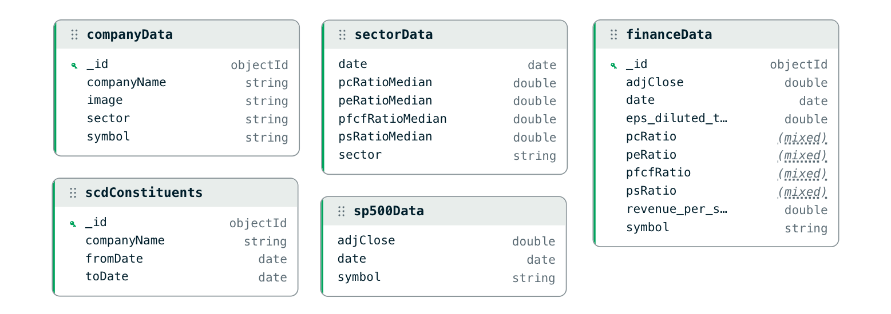

Abb. 3: Datenmodell. Quelle: Eigene Darstellung

Das Schema für **Company Data** kann folglich wie eine Dimension gesehen werden, die lediglich Kontextdaten beinhaltet, die für Aggregationen oder die Anzeige im Dashboard relevant sind.

Die **Constituents** Collection ist eine Slowly Changing Dimension und wird im Gegensatz zu den anderen Company-Bezogenen Collections nicht über den Ticker/ das Symbol referenziert, sondern über den Company Namen, da der Ticker / das Symbol im Index neu vergeben werden kann.

Die **Finance Data** - Collection ist eine Time Series Collection mit dem "timeField" : "date" und dem "metaField": "symbol". Somit werden Mongo-internen Buckets auf dem Date und dem Symbol erstellt. Die "granularity" ist auf "hours" konfiguriert, da die Datenpunkte aus tägliche Börsenwerte bestehen und "hours" die gröbste Granularität in Mongo ist. Somit werden Daten bis zu einem Monat gruppiert in die Buckets eingefügt. Die Ratio-Felder sind als nullable definiert, da nicht für jeden Datenpunkt alle Kennzahlen berechnet werden können – etwa bei einer negativen Price / Earnings Ratio.

**Sector Data** ist ebenfalls eine Time Series Collection und hat die gleiche Konfiguration wie die Finance Data Collection. Hier ist das "metafield" allerdings "sector" und damit sind die Buckets auch auf Sektor und date erstellt.

Das Schema für **SP500 Data** ist bis auf die fehlenden Ratios das gleiche wie die Finance Data Collection. Es handelt sich ebenfalls um eine Time Series.

Für alle Time Series Collections gilt, dass Dokumente kein eindeutiges \_id-Feld brauchen. MongoDB erstellt keinen Index auf \_id und deshalb spielt \_id für Performance oder Queries meist keine Rolle. Das \_id-Feld könnte also aus der Finance Data Collection auch entfernt werden. Da die \_id für Abfragen und Performance in Time Series Collections keine Rolle spielt, wurde auf eine explizite Entfernung verzichtet.

### Dashboard

Das Dashboard gliedert sich in fünf Pages, die den Funktionsumfang der Anwendung strukturiert abbilden.

#### Sector Page

Die **Sector Page** dient als Einstiegspunkt des Dashboards. Sie bietet eine sektorweite Übersicht, in der der Nutzer einen Sektor auswählen, verschiedene Ratios selektieren und die enthaltenen Unternehmen visuell miteinander vergleichen kann. Eine eingezeichnete Medianlinie ermöglicht dabei eine schnelle Einordnung einzelner Unternehmen relativ zur Peer Group.

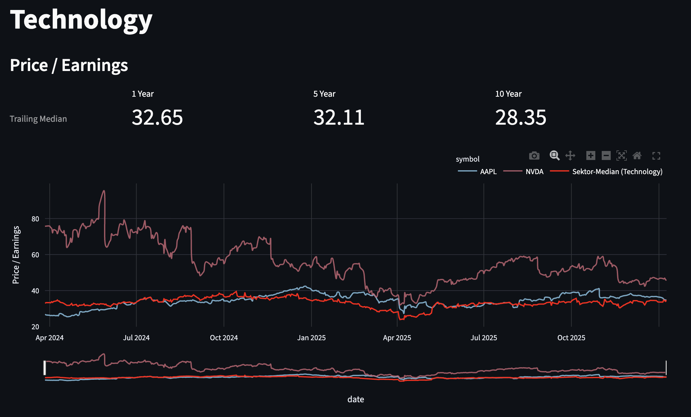

#### Company Page

Die **Company Page** ermöglicht die gezielte Analyse einzelner Unternehmen über eine Suchfunktion. Nach Auswahl eines Unternehmens werden Stammdaten, historische Aktienkurse sowie die zeitliche Entwicklung der verfügbaren Ratios dargestellt. Der historische Kursverlauf kann dabei dem S&P 500 gegenübergestellt werden. Zusätzlich werden die Renditen der letzten 1, 3, 5 und 10 Jahre ausgewiesen.

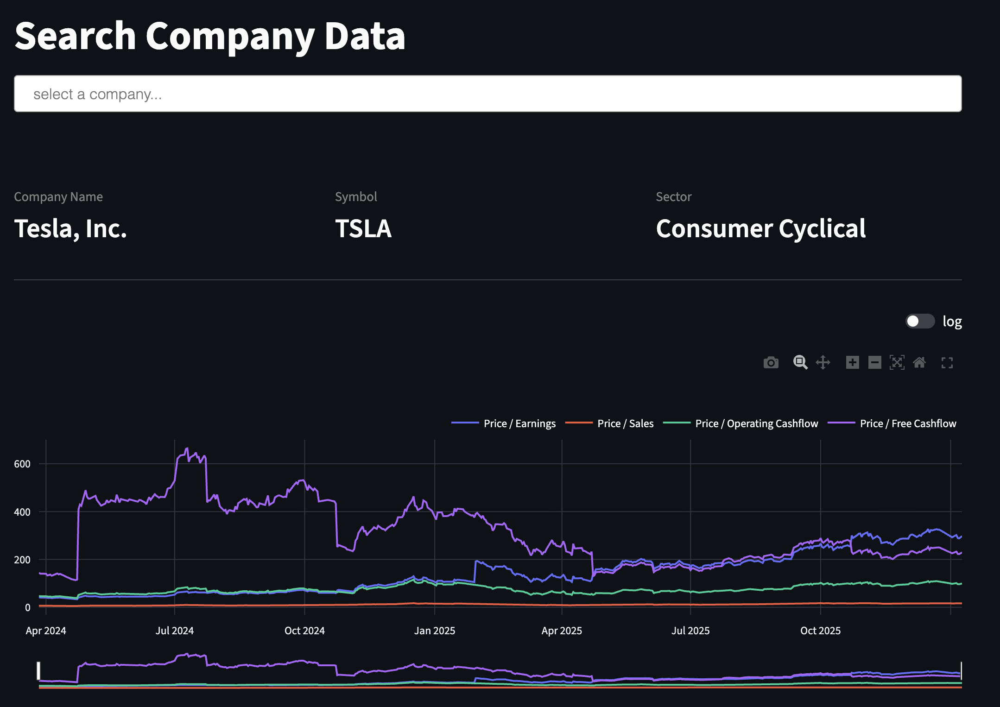
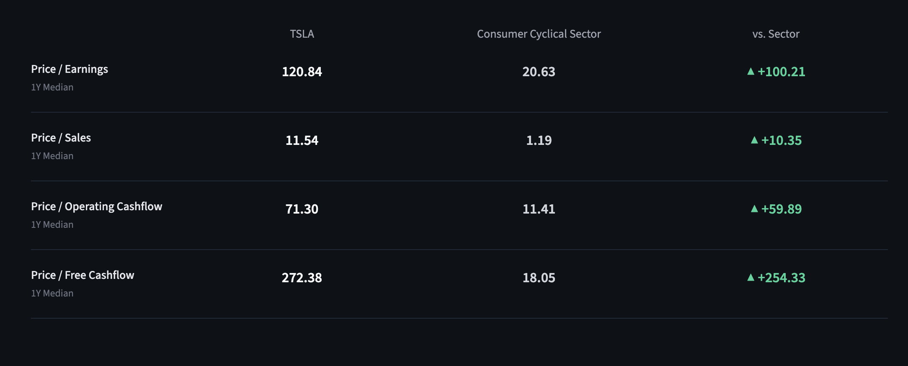
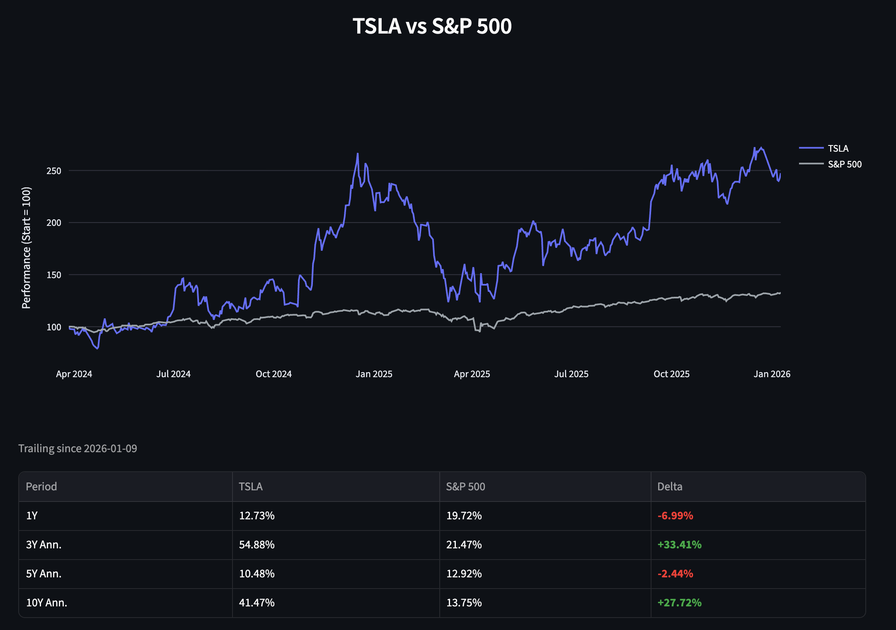

#### Top-10 Ranking Page Page

Die **Top-10 Ranking Page** zeigt die zehn bestplatzierten Unternehmen eines ausgewählten Sektors zu einem definierten Datum. Das Ranking kann wahlweise nach dem Combined Value Score oder dem Momentum Score dargestellt werden, was einen direkten Vergleich beider Strategien ermöglicht.

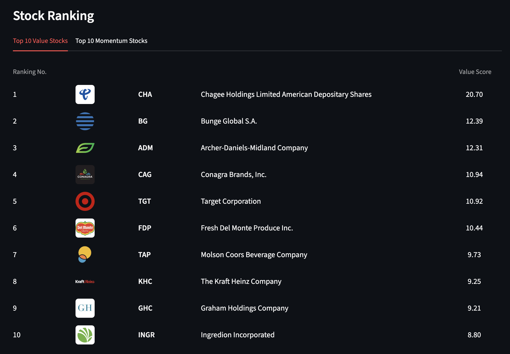

#### Full Ranking Page

Die **Full Ranking Page** stellt das vollständige sektorweite Ranking dar. Der Nutzer kann entweder den gesamten Sektor einsehen oder gezielt nach einzelnen Unternehmen suchen und deren Rankingposition nachvollziehen.

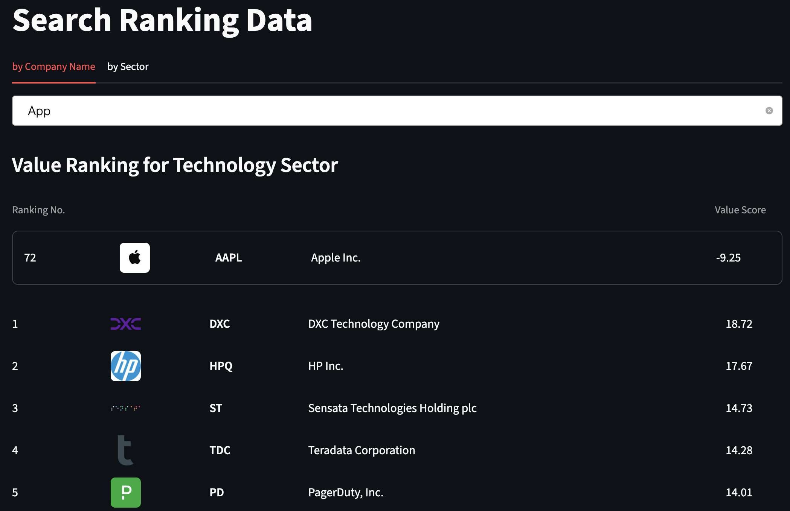

#### Pipeline Page

Die **Pipeline Page** dient als administrative Steuerungsseite der Anwendung. Über sie kann der Datenimport gestartet und die Verarbeitungspipeline ausgelöst werden. Sie bildet damit den operativen Einstiegspunkt für die Datenbeschaffung und -verarbeitung.

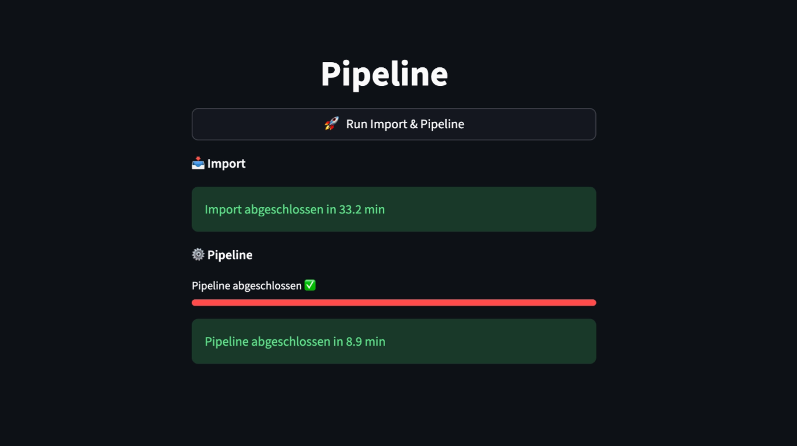

### Performance

Um geringe Antwortzeiten zu gewährleisten sind alle Ratios in der Finanzzeitreihe persistiert und diese ist als Timeseries Collection in Mongo konfiguriert. Timeseries Collection sind für Zeitreihen optimiert und ermöglichen dadurch geringe Ladezeiten für Abfragen. Die Zeitreihe wurde außerdem auf dem Ticker-Symbol und dem Datum indexiert, sodass Abfragen noch schneller bearbeitet werden.

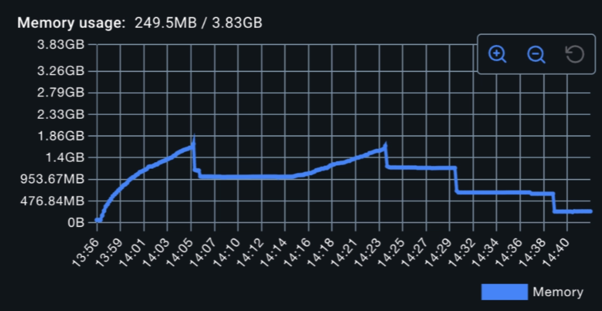
Die Erstellung der FinanceData Collection efolgt über Batch Inserts, bei denen Dokumente in definierten Blöcken geschrieben werden. Dies beschleunigt die Verarbeitung großer Datenmengen und begrenzt gleichzeitig den Arbeitsspeicherbedarf, da nie alle Dokumente gleichzeitig im RAM gehalten werden müssen. Die Anwendung kommt dadurch mit 2 GB RAM aus.
Besonders hervorzuheben ist, dass, sofern kein Business-Logik-Anteil vorliegt, das Mongo Aggregation Framework genutzt wird, welches die Datenverarbeitung auf Datenbankebene ermöglicht und damit den Datentransfer zwischen Datenbank und Anwendung minimiert.

Die Laufzeiten der einzelnen Pipeline-Schritte wurden über den Performance-Logger erfasst und sind in der Tabelle dokumentiert. Die Gesamtpipeline verarbeitet die Rohdaten von ca. 370 MB – bestehend aus rund 1.100 EOD-Preisdokumenten sowie 102.000 Income- und 110.000 Cashflow-Quartalsdaten – in einer Gesamtlaufzeit von ca. 5,5 Minuten. Da die Pipeline nur einmalig zur Datenbeschaffung ausgeführt wird und das Dashboard ausschließlich auf vorberechneten Daten operiert, ist diese Laufzeit für den produktiven Betrieb nicht relevant.
| Pipeline-Schritt | gemessene Laufzeit |
|---|---|
| scdConstituents | 0,10 s |
| Company Data | 0,06 s |
| S&P500 Zeitreihe | 0,11 s |
| eod_staged | 144,85 s |
| income_staged | 5,37 s |
| cashflow_staged | 5,47 s |
| FinanceData | 98,80 s |
| SectorData | 78,60 s |
| **Gesamt** | **~333 s** |

Der zeitintensivste Schritt ist die Erstellung von eod_staged mit 145 Sekunden, da das Aggregation Framework hier die verschachtelten Preishistorien aller S&P500-Unternehmen entschachtelt und als Einzeldokumente in die Staged Collection überführt. Für die Erstellung der FinanceData wird anschließend in Python über alle Handelstage iteriert und für jeden Datenpunkt die TTM-Kennzahlen aus den jeweils vier vorangegangenen Quartalsberichten berechnet. Dies dauert 99 Sekunden.

| Query              | gemessene Zeiten |
| ------------------ | ---------------- |
| `get_finance_data` | 3–74 ms          |
| `get_sector_data`  | 2–8 ms           |
| `get_sp500_data`   | 2–12 ms          |
| `get_ranking`      | 414–978 ms       |

Neben den Pipeline-Laufzeiten wurden auch die Antwortzeiten des Dashboards über den
Performance-Logger gemessen. Einfache Datenbankabfragen wie `get_finance_data`,
`get_sector_data` und `get_sp500_data` liefern Ergebnisse konsistent im einstelligen
bis zweistelligen Millisekundenbereich, was auf die Wirksamkeit des zusammengesetzten
Index auf Symbol und Datum zurückzuführen ist. Der rechenintensivste Dashboard-Aufruf
ist `get_ranking` mit 414–978 ms, da das Ranking nicht persistiert ist und bei jedem
Aufruf für alle Unternehmen eines Sektors neu berechnet wird.

# Fazit und Ausblick

Ziel dieser Arbeit war die Konzeption und prototypische Umsetzung einer Anwendung zur strukturierten Verarbeitung historischer Fundamentaldaten des S&P 500 sowie zur Berechnung und vergleichenden Analyse von Bewertungskennzahlen und darauf basierenden Rankings. Dieses Ziel konnte erfolgreich erreicht werden.

Die entwickelte Anwendung ermöglicht es, fundamentale Unternehmenskennzahlen über einen längeren Zeitraum konsistent darzustellen und sektorrelativ zu vergleichen. Es wurde eine vergleichbare Datenbasis geschaffen, indem die Kennzahlen nicht mehr nur auf Quartalsebene, sondern auf täglicher Basis berechnet werden, wodurch unternehmensspezifische zeitliche Unterschiede in den Bilanzierungszyklen explizit berücksichtigt werden können. Aufbauend darauf wurden mit dem Combined Value Score und dem Momentum Score zwei unterschiedliche Bewertungsansätze implementiert, die sowohl fundamentale als auch technische Perspektiven berücksichtigen und im Dashboard gegenübergestellt werden können.

Ein besonderer Fokus lag auf der softwaretechnischen Umsetzung. Durch die konsequente Anwendung von Clean Architecture, dem Dependency Inversion Principle sowie einer klaren Trennung von Verantwortlichkeiten konnte eine modulare, testbare und erweiterbare Systemarchitektur realisiert werden. Die Datenverarbeitung wurde bewusst zwischen Datenbankebene und Anwendungsebene aufgeteilt, um sowohl Performancevorteile als auch eine klare Trennung von Businesslogik und Datenmanipulation zu gewährleisten.

Trotz der positiven Ergebnisse beschränkt sich der Combined Value Score auf eine Auswahl weniger Kennzahlen und berücksichtigt keine weiteren fundamentalen oder qualitativen Faktoren. Auch erfolgt keine empirische Validierung der verwendeten Strategien, sodass keine Aussage über deren tatsächliche Performance am Kapitalmarkt getroffen werden kann.

Diese Einschränkungen bilden zugleich den Ausgangspunkt für weiterführende Arbeiten. Im Rahmen der Bachelorarbeit kann die entwickelte Anwendung, sowie die entstandende Datengrundlage genutzt und erweitert werden, um eine systematische Backtesting-Analyse der implementierten Value- und Momentum-Strategien durchzuführen. Ziel ist es, die Performance der Scores über verschiedene Zeiträume und Sektoren hinweg zu evaluieren und deren Aussagekraft quantitativ zu untersuchen.

Darüber hinaus bieten sich Erweiterungen wie die Integration zusätzlicher Kennzahlen oder die Einbindung weiterer Märkte und Indizes an.

Insgesamt stellt die entwickelte Anwendung eine solide Grundlage für weiterführende finanzanalytische Untersuchungen dar und verbindet datengetriebene Methoden mit einer skalierbaren Softwarearchitektur.

# Literaturverzeichnis

Martin, Robert C..

_Clean Architecture : Das Praxis-Handbuch für professionelles SoftwaredesignRegeln und Paradigmen für effiziente Softwarestrukturierung_, mitp, 2018. _ProQuest Ebook Central_, http://ebookcentral.proquest.com/lib/koln/detail.action?docID=5311206. Created from koln on 2026-03-25 10:59:00.

Martin, Robert C.:

_The Dependency Inversion Principle_. Mai 1996 ([PDF](https://web.archive.org/web/20110714224327/http://www.objectmentor.com/resources/articles/dip.pdf) ([Memento](https://de.wikipedia.org/wiki/Webarchivierung#Begrifflichkeiten) vom 14. Juli 2011 im [_Internet Archive_](https://de.wikipedia.org/wiki/Internet_Archive))).

Investopedia. Value Investing Definition, How It Works, Strategies, and Risks. Juli 2025 https://www.investopedia.com/terms/v/valueinvesting.asp

Estoppey Value Investments. (2024). What is a Value Composite?
Abgerufen am 26.03.26 von
https://valueinvestments.ch/en/lexicon/value-composite/

O'Shaughnessy, J. P. (2011). What Works on Wall Street:
The Classic Guide to the Best-Performing Investment
Strategies of All Time (4. Aufl.). McGraw-Hill.

Sue Man Fan, Multiple Tests für die Evaluation von Prognosemodellen, 2010, S. 87, [Google Books](https://www.google.de/books/edition/Multiple_Tests_f%C3%BCr_die_Evaluation_von_P/q7dFUZp9h5kC?hl=de&gbpv=1&dq=momentum+zeitreihe&pg=PA87&printsec=frontcover)

JEGADEESH & TITMAN, Returns to Buying Winners and Selling Losers: Implications for Stock Market Efficiency, 1993 https://doi.org/10.1111/j.1540-6261.1993.tb04702.x

Jegadeesh, N. and Titman, S. (1993) ‘Returns to Buying Winners and Selling Losers: Implications for Stock Market Efficiency’, Journal of Finance (Wiley-Blackwell), 48(1), pp. 65–91. doi:10.1111/j.1540-6261.1993.tb04702.x.
https://research.ebsco.com/c/u5zo7q/viewer/pdf/ueaq7mfh2b

Härtung, J.; Elpelt, B.; Klösener, K.-H. (2004):
Lehr- und Handbuch der angewandten Statistik. 9. Auflage, Oldenbourg Verlag, München, S. 42.

Iglewicz, B.; Hoaglin, D. C. (1993): How to detect and handle outliers. Milwaukee: ASQC Quality Press.

MongoDB, Inc., 2026. MongoDB Developer Documentation. [online] Available at: https://www.mongodb.com/docs/development/
[Accessed 30 March 2026].
